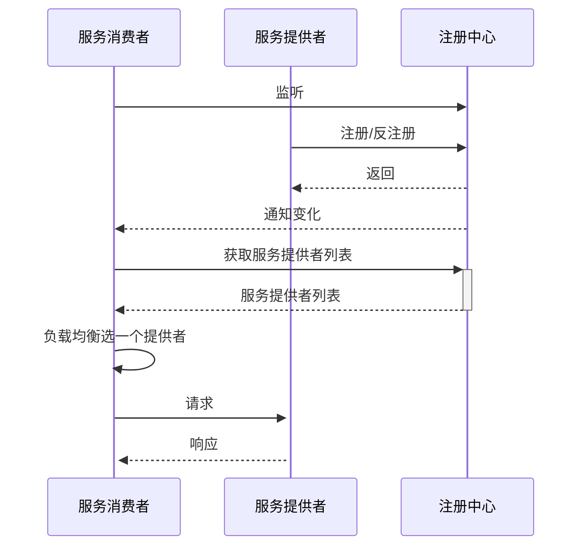

# 1. 根据微服务框架dubbo的架构图，画出dubbo进行一次微服务调用的时序图
张彦功

```mermaid
sequenceDiagram
    participant 服务消费者
    participant 服务提供者
    participant 注册中心
    
    服务消费者 ->> 注册中心 : 监听
    服务提供者 ->> 注册中心 : 注册/反注册
    注册中心 -->> 服务提供者 : 返回
    注册中心 -->> 服务消费者 : 通知变化
    服务消费者 ->> + 注册中心 : 获取服务提供者列表
    注册中心 -->> - 服务消费者 : 服务提供者列表
    服务消费者 ->> 服务消费者 : 负载均衡选一个提供者
    服务消费者 ->> + 服务提供者 : 请求
    服务提供者 -->> + 服务消费者 : 响应
   
```