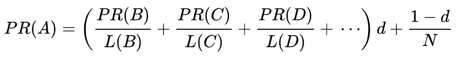

# 题目2

Google搜索引擎是如何对搜索结果进行排序的？（请用自己的语言描述PageRank算法。）

# 解答
### 算法思想

1. 被很多网页链接的网页，PageRank值高
2. PageRank值高的网页链接的网页，PageRank值也相对高

## 算法描述

参考了：https://zh.wikipedia.org/wiki/PageRank

PageRank让链接来"投票"。一个页面的“得票数”由所有链向它的页面的重要性来决定。一个页面的PageRank是由所有链向它的页面（“链入页面”）的重要性经过递归算法得到的。

1. 算法将根据每个页面连出总数 L(x)平分该页面的PR值，并将其加到其所指向的页面
2. PR值被换算成百分比形式再乘上一个修正系数d
3. 由于“没有向外链接的网页”传递出去的PR值会是0，赋给每个页面一个最小值(1-d)/N
4. 经过重复计算，这些页面的PR值会趋向于某个定值

