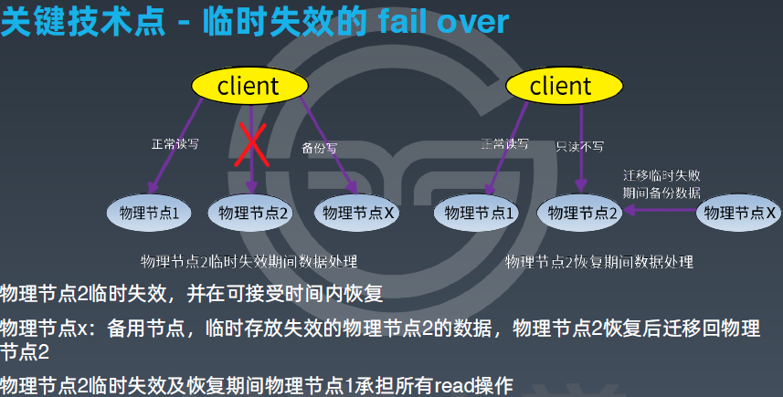
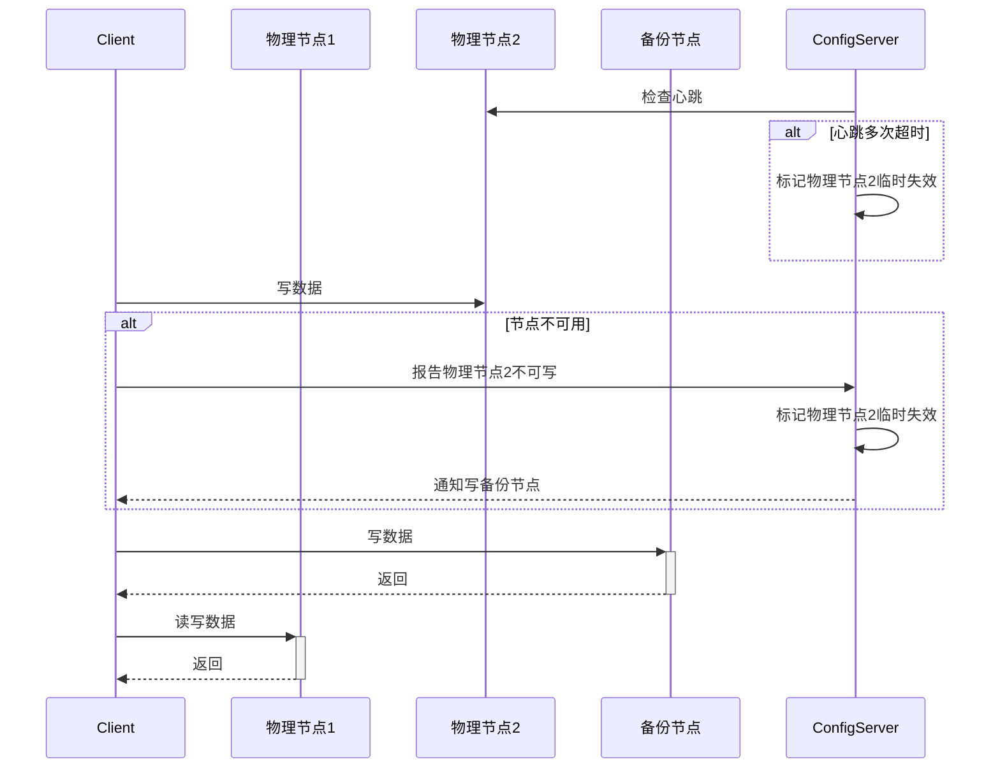
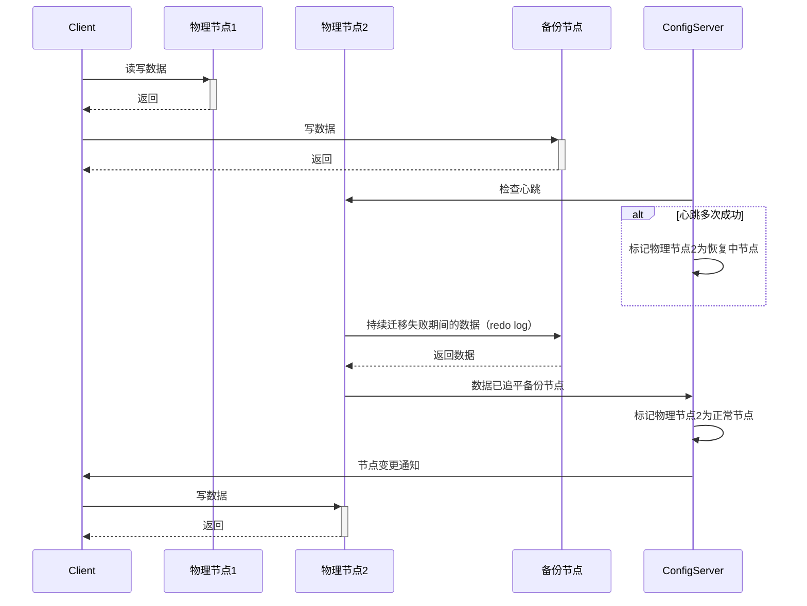

# 针对案例，请用UML时序图描述 Doris 临时失效的处理过程

1. 写2个节点，读1个节点

   

## 临时失效

```mermaid
sequenceDiagram
    participant Client
    participant 物理节点1
    participant 物理节点2
    participant 备份节点
    participant ConfigServer
    
    ConfigServer ->> 物理节点2 : 检查心跳
    alt 心跳多次超时
    ConfigServer ->> ConfigServer : 标记物理节点2临时失效
    end    
    
    Client ->> 物理节点2 : 写数据
    alt 节点不可用
    Client ->> ConfigServer : 报告物理节点2不可写
    ConfigServer ->> ConfigServer : 标记物理节点2临时失效
    ConfigServer -->> Client : 通知写备份节点
    end
    Client ->> + 备份节点 : 写数据
    备份节点 -->> - Client : 返回
    Client ->> + 物理节点1 : 读写数据
    物理节点1 -->> - Client : 返回
   
```

## 恢复期间

```mermaid
sequenceDiagram
    participant Client
    participant 物理节点1
    participant 物理节点2
    participant 备份节点
    participant ConfigServer
    
    Client ->> + 物理节点1 : 读写数据
    物理节点1 -->> - Client : 返回
    Client ->> + 备份节点 : 写数据
    备份节点 -->> - Client : 返回
    
    ConfigServer ->> 物理节点2 : 检查心跳
    alt 心跳多次成功
    ConfigServer ->> ConfigServer : 标记物理节点2为恢复中节点
    end    
    
    物理节点2 ->> 备份节点 : 持续迁移失败期间的数据（redo log）
    备份节点 -->> 物理节点2 : 返回数据
    物理节点2 ->> ConfigServer : 数据已追平备份节点
    ConfigServer ->> ConfigServer : 标记物理节点2为正常节点
    ConfigServer ->> Client : 节点变更通知
    Client ->> + 物理节点2 : 写数据
    物理节点2 -->> - Client : 返回
   
```