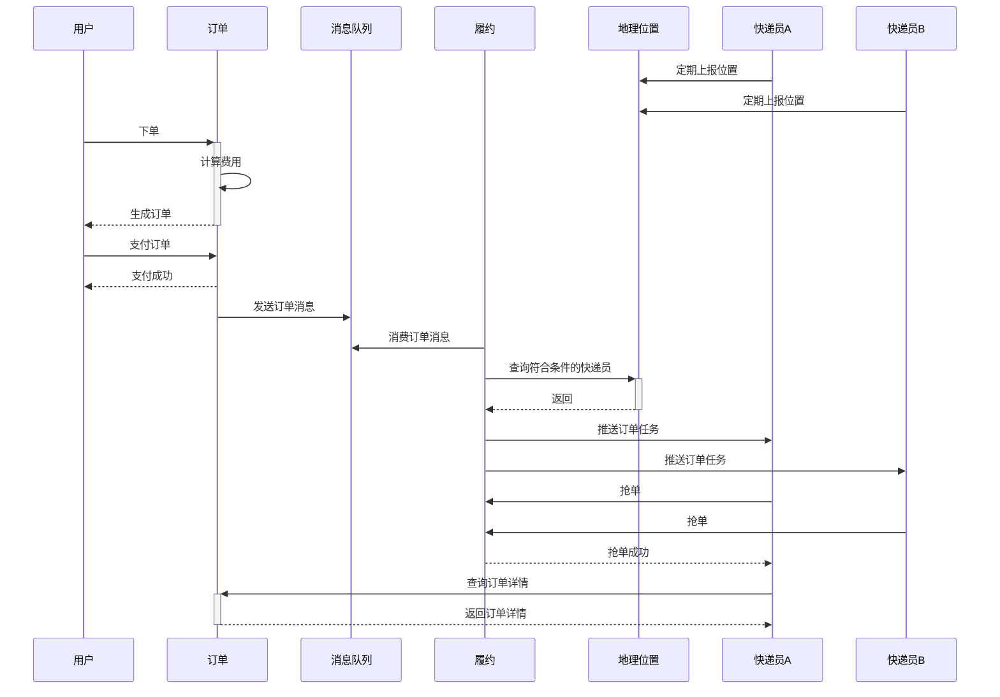

```mermaid
sequenceDiagram
    participant 用户
    participant 订单
    participant 消息队列
    participant 履约
    participant 地理位置
    participant 快递员A
    participant 快递员B
    
    快递员A ->> 地理位置 : 定期上报位置
    快递员B ->> 地理位置 : 定期上报位置
    
    用户 ->>+ 订单 : 下单
    订单 ->> 订单 : 计算费用
    订单 -->>-  用户 : 生成订单
    用户 ->> 订单 : 支付订单
    订单 -->>  用户 : 支付成功
    订单 ->> 消息队列 : 发送订单消息
  
    履约 ->> 消息队列 : 消费订单消息
    履约 ->>+ 地理位置 : 查询符合条件的快递员
    地理位置 -->>- 履约 : 返回
    履约 ->> 快递员A : 推送订单任务
    履约 ->> 快递员B : 推送订单任务
    快递员A ->> 履约 : 抢单
    快递员B ->> 履约 : 抢单
    履约 -->> 快递员A : 抢单成功
    快递员A ->>+ 订单 : 查询订单详情
    订单 -->>-  快递员A : 返回订单详情
   
```

