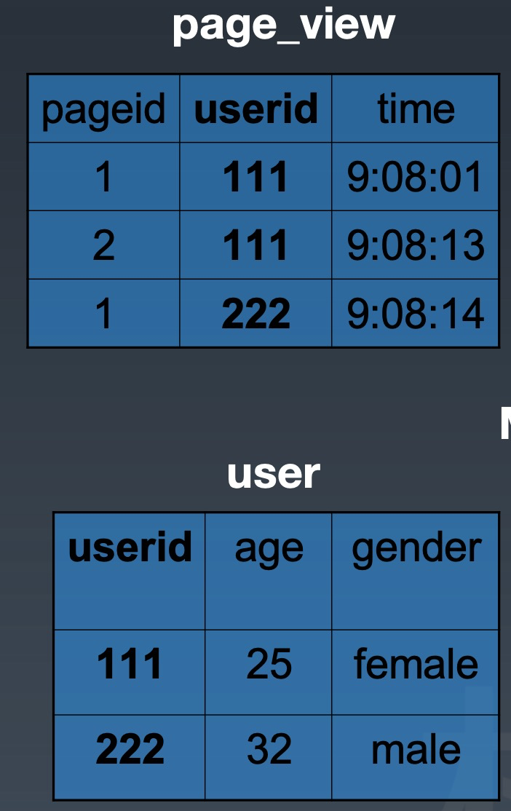
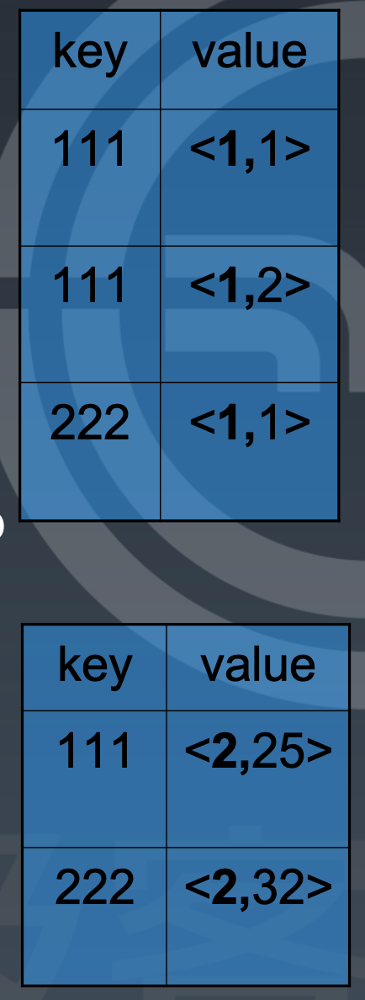
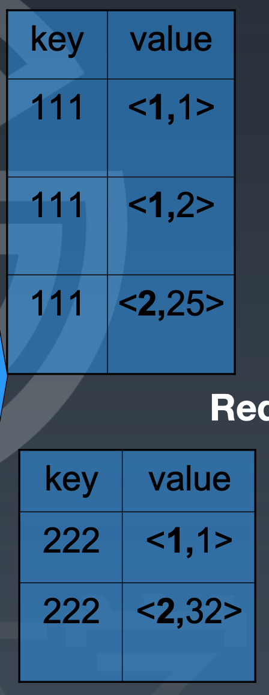
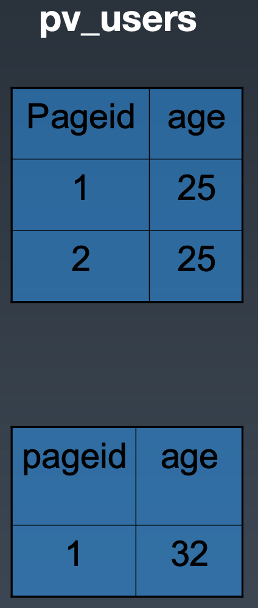

# 题目2

# 解答

## map 函数

1. 输入：page_view、user 的每一个行
   1. 
2. 输出：userId 为key，value 是表id 和 pageid
   1. 在map的输出value中为不同表的数据打上tag标记，在reduce阶段根据tag判断数据来源
   2. 

## reduce 函数

1. 输入：map 的输出根据 key（userid）排序
   1. 
2. 输出：根据 key（userid）join  value（表id、age），输出 pv.pageid，u.age
   1. 