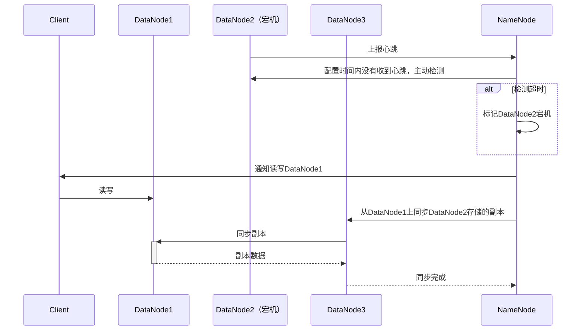

# 1. 有两个单向链表（链表长度分别为m，n），这两个单向链表有可能在某个元素合并，如下图所示的这样，也可能不合并。现在给定两个链表的头指针，在不修改链表的情况下，如何快速地判断这两个链表是否合并？如果合并，找到合并的元素，也就是图中的 x 元素。请用（伪）代码描述算法，并给出时间复杂度和空间复杂度。
## 算法思想
1. 长的链表先走|len1 - len2|步
2. 同时遍历两个链表，找到第一个相同的节点

## 代码

见 main.go、list.go

## 复杂度

时间复杂度：O(n)
空间复杂度：O(n)

# 2.请画出DataNode服务器节点宕机的时候，HDFS的处理过程时序图。

