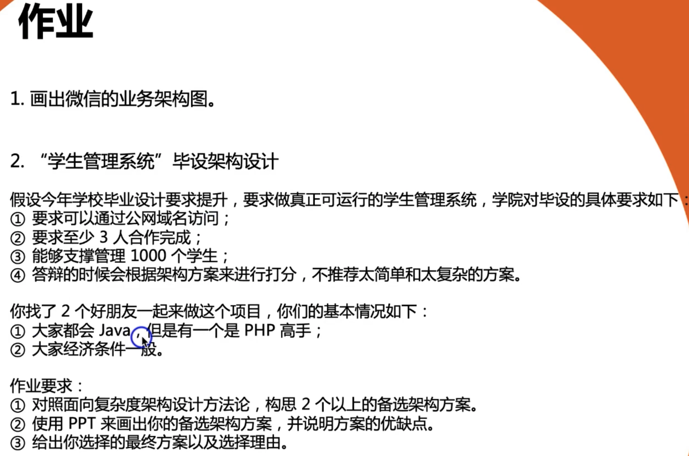
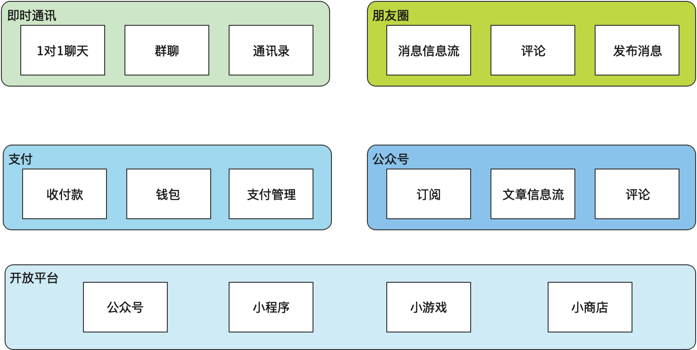
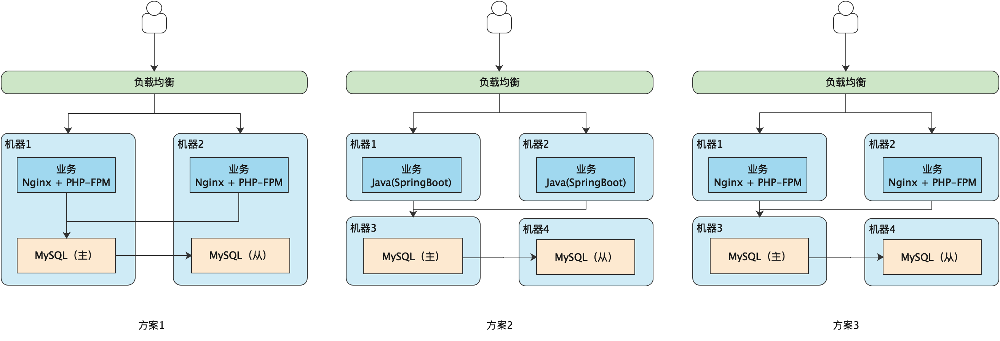

# 模块一作业
## 作业说明

## 作业1

## 作业2

### 需求分析

1. 管理 1000 个学生：并发较低，性能不是瓶颈
2. 学生管理系统包括以下子模块
   1. 人员管理：维护学生基本信息
   2. 机构管理：学院、系、班级
   3. 权限管理：区分管理员、老师、学生等权限
   4. 考试管理：成绩录入
   5. 选课系统：选课

### 概要设计

1. 尽量复用学校已有的基础设施。若缺少基础设施，采用云厂商的方案。
   1. 公网域名：在学校官网下的三级域名
   2. 负载均衡：复用学校的、购买云厂商的方案
   3. MySQL ：复用学校的、自己搭建
2. 三人合作完成：需要拆分模块，每人独立负责一部分
   1. 单体架构，采用 MVC 开发
   2. Git 管理源代码，采用 gitee/gitlab

### 架构方案

### 方案选择

|                      | 方案1  | 方案2 | 方案3  |
| -------------------- | ------ | ----- | ------ |
| 开发语言             | PHP    | Java  | PHP    |
| 开发语言熟悉度       | 有高手 | 都会  | 有高手 |
| 推荐部署机器         | 2台    | 4台   | 4台    |
| 最低部署机器（单点） | 1台    | 2台   | 2台    |

推荐方案：方案3。原因：有 PHP 高手方便解决问题，业务和 MySQL 分开部署方便后期运维。

