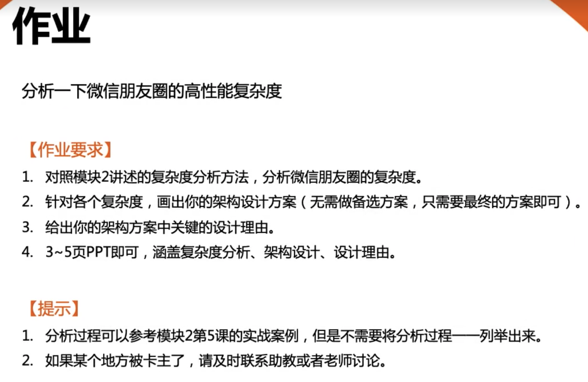
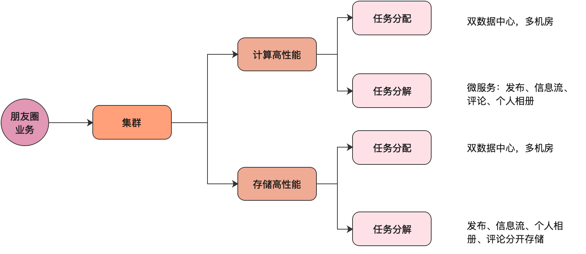
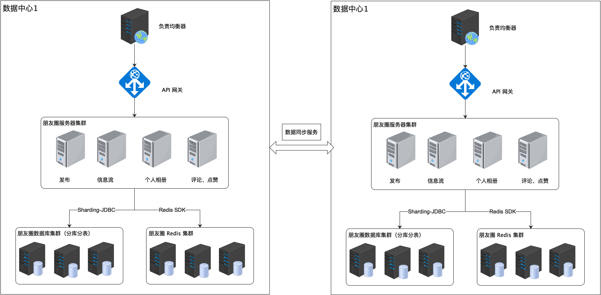

# 模块二作业
## 作业说明

## 公开数据

截止2020底，每天有7.8亿用户进入朋友圈，1.2亿用户发布朋友圈（2021微信公开课）

截止到2015年7月，微信每月活跃用户约5.49亿，朋友圈每天的发表量（包括赞和评论）超过10亿，浏览量超过100亿。

## 性能评估

每天按 10 个小时，峰值系数按 3 倍算

发布：10 亿 / 10 小时 * 3 = 8.3万 QPS

浏览：100亿/ 10 小时 * 3 = 83 万 QPS

## 复杂度分析

朋友圈属于业务复杂度低，但质量复杂度高

### 包括的主要需求

1. 发布消息，包括：文字、图片、视频、谁不可以看等
2. 浏览：读取信息流
3. 查看个人相册，记录了用户发布的所有内容
4. 给某条信息评论和点赞

## 高性能分析

微信是双向关系，有好友上限，故信息流采用“推”的方式，把发布的消息推到所有好友的信息流中

“发布”是最重要的操作，数据采用异步方式复制

### 发布

1. 图片、视频上传到 CDN，发布记录只记录图片、视频的属性和 URL
2. 发布 ID 异步写入好友的信息流中（排查不可以看的好友）

### 个人相册

1. 记录了用户发布的所有内容，主要记录用户 ID 和 发布 ID 的关联

### 浏览

1. 拉取自己的信息流
2. 评论和点赞

## 技术方案

### 计算

1. 双数据中心，每个数据中心多个机房
2. 读操作使用多级缓存抗量（本地换成、远程缓存）

### 存储

1. 按用户所属地区分数据中心（比如：北方用户、南方用户）
2. 同数据中心再按用户 ID 分库分表
3. 数据中心使用数据同步服务异步同步数据

## 高性能方案

## 整体架构图

