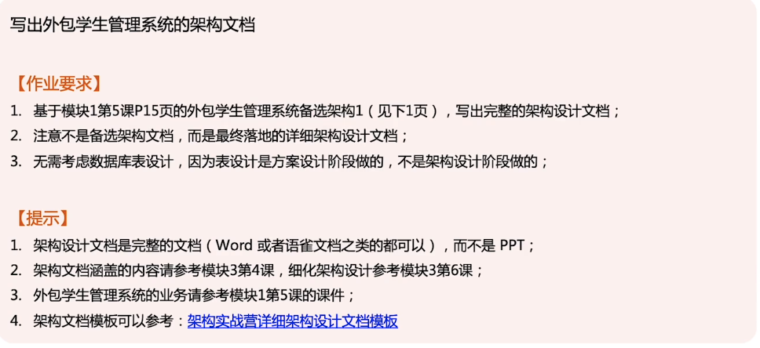
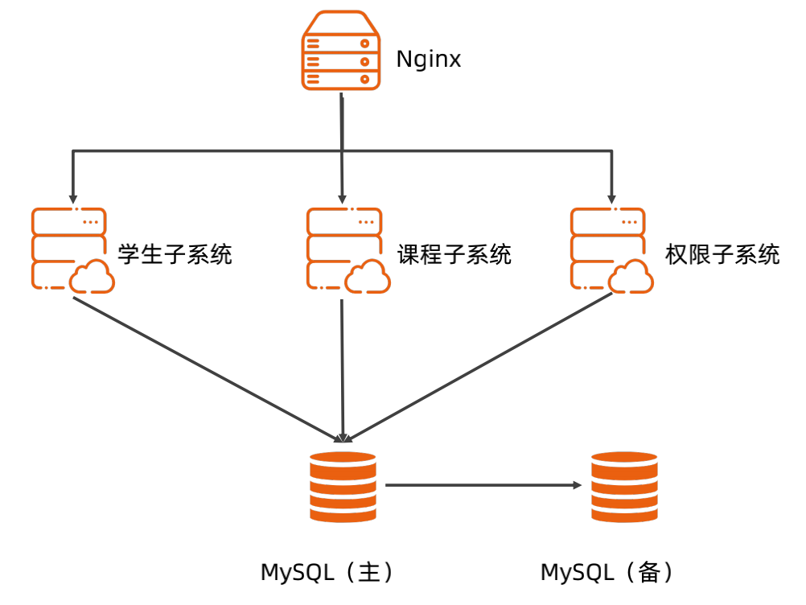
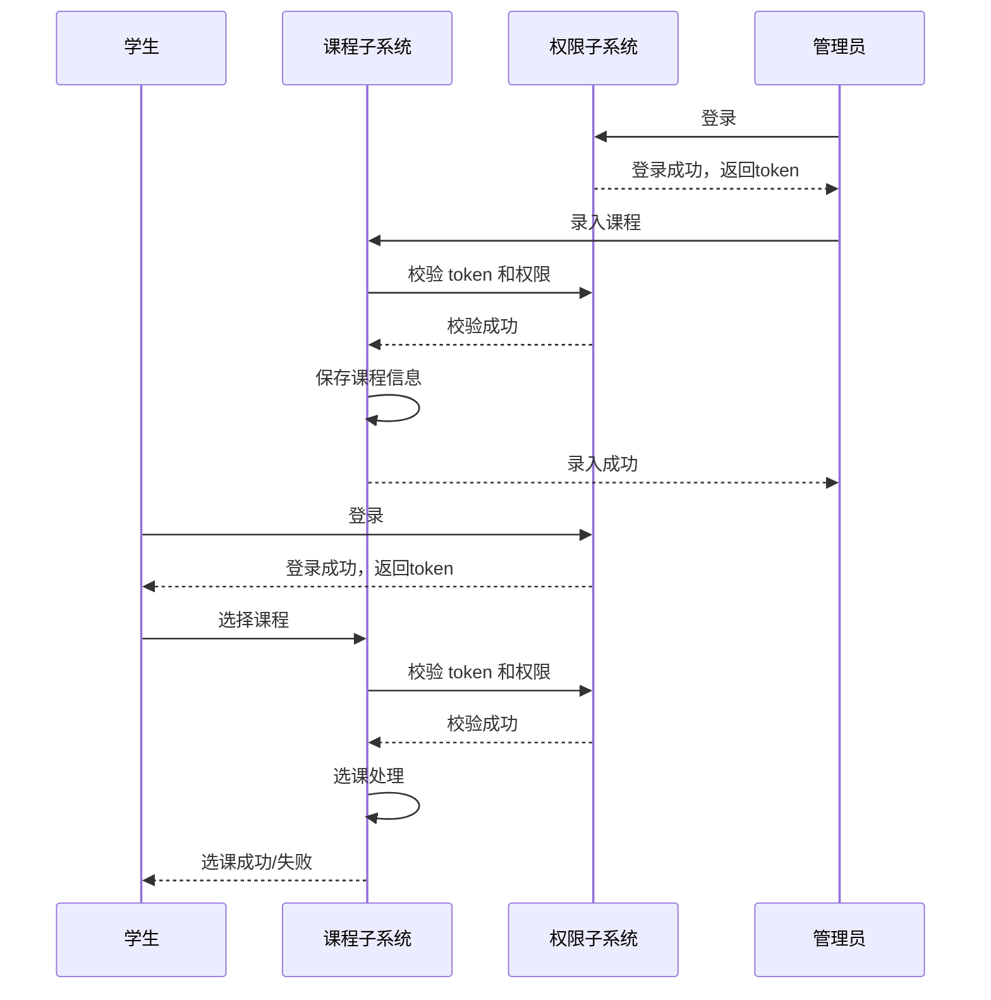
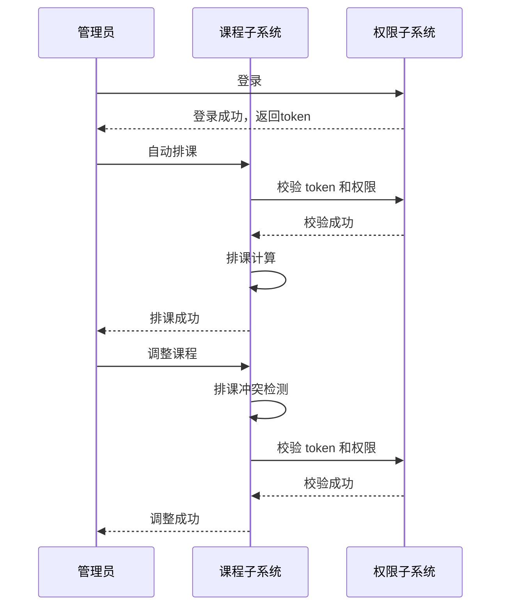

# 作业说明

# 前言

本文是学生管理系统的详细架构设计文档，用于学生管理系统后续的开发、测试和运维

# 词汇表

| 术语   | 中文解释           | 备注 |
| ------ | ------------------ | ---- |
| casbin | 开源访问控制框架   |      |
| MySQL  | 关系数据库         |      |
| RBAC   | 基于角色的访问控制 |      |

# 1. 业务背景

随着学校的规模的不断扩大，学生数量的增加，需要处理的信息也日趋增大。不仅花费大量的教师资源，处理效率也十分低下。

要解决的问题：

1. 学生信息管理数据信息量大修改不方便
2. 对一系列数据进行分析时花费时间长

实现的目标：

1. 提高学生管理的管理水平，优化资源，尽可能降低管理成本

完成的任务：

1. 实现学生信息管理的系统化、规范化、自动化
2. 管理学生相关信息：学籍、课程、成绩等

# 2. 约束和限制

1. 数据高可用：数据不要全部丢失
2. 复用学校已有的基础设施（负载均衡、MySQL 数据库、监控平台等）
2. 采用浏览器/服务器模式（B/S），不需要开发 APP
2. 成本不超过 20 万

# 3. 总体架构

1. 学校在校学生数增长可控。目前在校生最大的大学：[73000](https://new.qq.com/omn/20200526/20200526A007CX00.html)
2. 假设每位师生每天访问10次，集中在6个小时，峰值系数3，则 73000 * 10 / 6 / 3600 *3 = 105 QPS
3. 选课，类似秒杀，假设在1分钟内选完，73000 / 60 = 1216 QPS

## 3.1 架构分析

1. 高性能：本校使用，除选课外，其他 QPS 都在 100 左右，性能不高
2. 高可用：数据高可用，数据不要全部丢失
3. 可扩展：业务需求比较复杂，需要可扩展
4. 成本：外包项目，需要控制成本
5. 安全：本校使用，安全要求相对低

## 3.2 总体架构

1. 负载均衡复用学校已有的基础设置
2. 采用微服务架构，拆分成学生、课程、权限三个子系统
3. MySQL 主备方案，读写都走主库，备库只做备份，保证数据不丢失
3. MySQL 主库宕机后，整体服务不可用，等运维介入恢复

# 4. 详细设计

## 4.1 核心功能

### 4.1.1 课程管理

#### 4.1.1.1 课程录入和选课

1. 课程录入：由管理员对相应课程体系进行录入，供学生、教师进行在线选择。

2. 选课功能：学生可以在线对自己的课程体系进行选择，相对应的课程选择功能类比。

### 4.1.1.2 排课系统

排课功能：此功能根据学生选定的课程和教学体系安排，对相应教师、教室、时间进行统一规划安排。

## 4.2 关键设计

### 4.2.1 数据高可用

1. MySQL 主备方案，读写都走主库，备库实时同步主库的数据
2. 在备库上每天全量备份数据库，备份数据在本地和远程（文件存储、FTP等）各存储一份
3. MySQL 主库宕机后，整体服务不可用，等运维介入恢复

### 4.2.2 权限模型

1. 基于 RBAC（Role-based access control）设计权限子系统
2. 角色：学生、教师、管理员、辅导员

## 4.3 设计规范

1. 开发语言：Java，开发规范参考：[Java开发手册]( https://github.com/alibaba/p3c)
2. 开发框架：SpringBoot
3. 通信协议：http + json
4. API 设计：[面向资源的设计](https://cloud.google.com/apis/design/resources?hl=zh-cn)
5. 接口管理：[Springfox](https://github.com/springfox/springfox) 基于代码注释自动生成文档
6. MySQL 使用 Innodb 存储引擎，数据库设计规范参考：[数据库开发](https://github.com/alibaba/p3c)
6. 权限：采用开源库 [jcasbin](https://github.com/casbin/jcasbin)

# 5. 质量设计

1. 可测试性：
   1. 根据 swagger 生成的接口自动化测试

2. 可维护性：
   1. 采用微服务，各子系统独立部署，互补影响

3. 可观测性：
   1. 规范的日志，不需要 metric 和 tracing

4. 成本：
   1. 5台虚拟机，其中3台部署业务系统、两台部署 MySQL 主备

# 6. 演进规划

1. 学生管理系统一期
   1. 权限子系统
   2. 学生子系统
   3. 课程子系统
2. 学生管理系统二期
   1. 考试子系统

