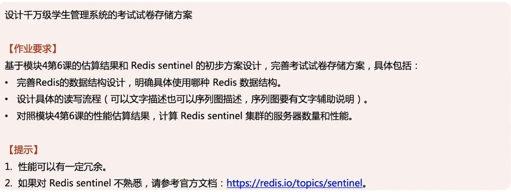

# 作业说明

# 考试试卷存储方案

## 数据结构设计

###学生查询自己的考试安排

使用 redis hash 存储

key：学校ID + 编号，加编号是为了解决热点 key 问题，值和参加学校的学生数正相关

value：hash key：学生ID，hash value：考试列表

### 考试开始前获取试卷

使用 redis string 存储

key：学校ID + 试卷ID + 编号，加编号是为了解决热点 key 问题，值和参加考试的学生数正相关

value：试卷内容，json 格式压缩后再 base64

## 读写分析

1. 老师录入课程的考试计划，保存数据库成功后，异步更新对应学生的考试安排
   1. key：学校ID + 编号，编号 = 学生ID % 50
2. 老师录入考试试卷，保存到 redis 中，编号 = 学生ID % 10
3. 学生获取查询自己的考试安排，用学校ID + 编号编号 = 学生ID % 50 获取考试列表
4. 考试开始前获取试卷，用学校ID + 试卷ID + 编号（学生ID % 10）获取试卷内容

### Redis 服务器数量

请求试卷：1000万 * 20（课）/ 20(周末不考试） / 4（每天4堂考试）/ 1分钟 = 250万请求/分钟 ≈ 5万/每秒。 

参考的性能测试：

1. 官方： https://redis.io/topics/benchmarks
2. 腾讯云：https://cloud.tencent.com/document/product/239/17952
3. 阿里云：https://help.aliyun.com/document_detail/26350.html

推荐配置（有冗余）：

3台机器（每台都部署 Redis Server 和 Redis  Sentinel ）

1主2从，主从都承担读流量

配置：16C32G

