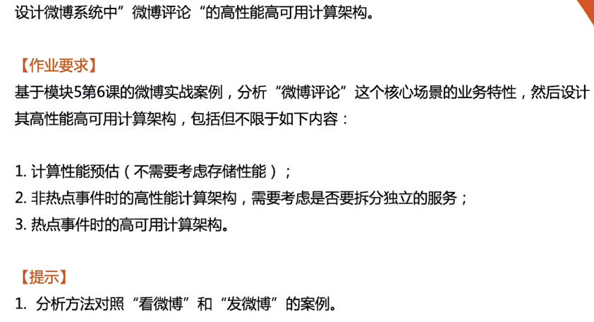

# 作业说明

# 微博评论计算架构

### 评论的属性

1. 微博ID
2. 用户ID
3. 评论ID
4. 评论内容
5. 评论时间
6. 父评论ID（支持多级评论）
7. 热度（统计、机器学习等算出）
8. 评论点赞数

## 用户行为建模和性能估算

### 发评论

参考课程PPT发微博的数据，假设 20% 的微博会被评论，评论数10，则发评论高峰4小时的 TPS：
2.5亿 * 20% * 10 * 60% / (4 * 3600) =  20K/s

### 看评论

假设平均一条评论观看人数有 50 次，则发评论高峰4小时的 TPS：
2.5亿 * 20% * 50 * 60% / (4 * 3600) =  1000K/s

## 非热点事件时计算架构

### 发评论

1. 发评论和发微博业务特性类似，采用多级负载均衡
2. 发评论依赖登陆状态，选择“轮训”或者“随机”负载均衡算法
3. 发评论可以使用写缓存，服务端写入消息队列（Kafka）即可视为发布成功
4. 业务服务器数量估算：一个服务处理 500 TPS，需要40台服务器，加上冗余共50台服务器

### 看评论

1. 看评论和发微博业务特性类似，采用多级负载均衡和多级缓存架构
2. 游客可以看评论，采用轮训”或者“随机”负载均衡算法
3. CDN 缓存只缓存前30条（前3页）的评论，区分按热度和按时间两个维度
4. 假设 CDN 能承担 90% 的请求量，则QPS为 100k/s。假设一个服务能处理 1k/s，需要100台机器，加上冗余共120台机器

### 整体架构

1. 任务分配：双机房、三机房
2. 任务分析：考虑到发评论和看评论的需求迭代速度不一样，需要做到业务隔离，故拆分成两个微服务

### 热点事件时计算架构

看微博是发评论和看评论的前提。当发评论和看评论的请求量暴涨时，看微博的请求量会在之前暴涨

1. 看评论：多副本缓存应对热点，必要时只展示按最新时间排序的前10页评论，不支持翻到10页以后。
2. 写评论：使用写缓存，先保存到消息队列中，后台异步批量写到存储，必要时可以丢弃一些价值不高的评论。

