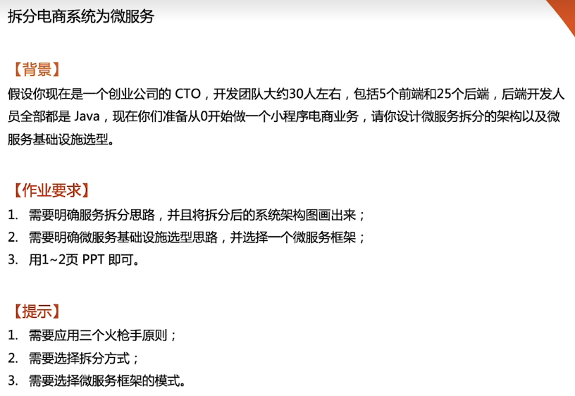
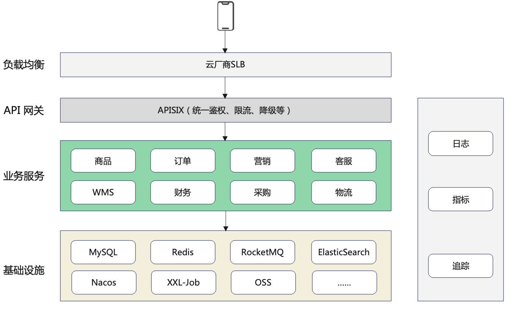

# 作业说明

# 电商微服务架构

## 服务拆分

25 个后端，跟进三个火枪手原则，大约拆分 8 个服务

按业务拆分微服务

### 交易业务

1. 商品：包括库存、价格系统
2. 订单：包括退货、退款逆向交易流程
3. 营销：包括促销、优惠券、运营等系统
4. 客服

### 供应链业务

1. 仓库管理（WMS）
2. 财务
3. 采购

### 公共业务

1. 用户中心

### 微服务框架选型

选择 [Spring Cloud Alibaba](https://github.com/alibaba/spring-cloud-alibaba/blob/master/README-zh.md)

1. 后端开发人员全部都是 Java，有 dubbo rpc 框架
2. 创业初期，上云最方便
3. Nacos：注册中心、配置中心
4. RocketMQ：消息队列
5. Seata：分布式事务
6. Sentinel：限流、熔断

## 系统架构图

1. CND、对象存储OSS使用云厂商
2. APM 选 skywalking
3. 分布式调度 选 XXL-Job
