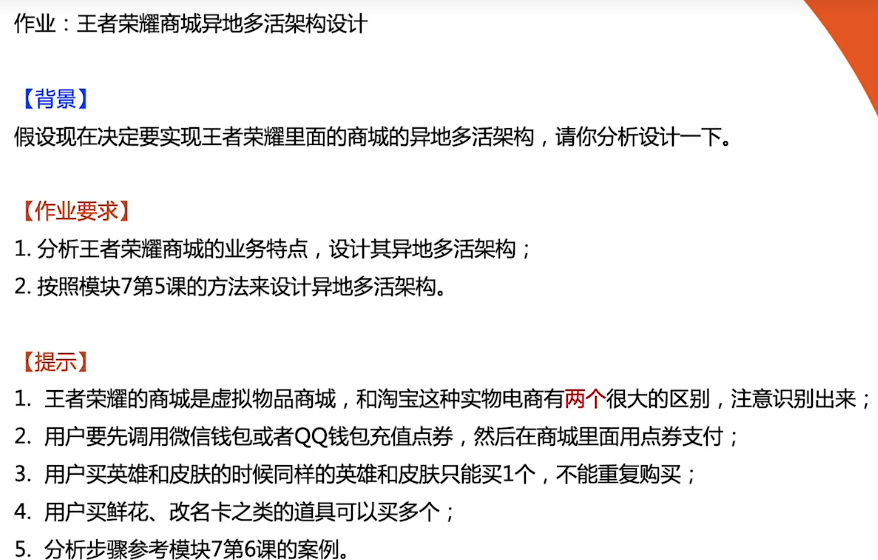

# 作业说明

# 商城异地多活架构

## 业务特点

1. 虚拟物品商城，没有库存的限制
2. 同样的英雄和皮肤只能买一个。即：有购物限制
3. 先充值点券，购买用点券支付。即：购买在商城系统中完成
4. 商品、商品种类不多

## 数据分类

1. 用户标识：王者荣耀全局唯一 RoleID
1. 点券流水：记录点券的使用详细（充值、购买）
1. 点券：类似余额，关联到 RoleID
1. 商品：商品ID全局唯一，可用算法生成
1. 订单：订单ID全局唯一，可用算法生成

### 数据同步

1. 用户标识：保持数据库同步
2. 点券流水：无修改（充值、购买时都是新增流水）、最终一致性，采用数据库和消息队列同步
3. 点券：充值、购买时有修改，强一致性，不可丢失，采用数据库同步
4. 商品：不涉及到库存，有购买限制。商品数不过，采用数据库同步
5. 订单：强一致性，不可丢失，采用数据库同步

### 异常处理

1. 充值第三方（微信钱包、QQ钱包）挂了怎么办？

挂公告，引导到可用的第三方充值，若没有可用的第三方，提醒稍后再来充值。

2. 充值成功，但点券没有增加

充值和增加点券应该在同一个分布式事务中，出现概率较小。可定期使用充值流水对账，自动修复该问题

3. 充值的点券未及时同步到异地机房

若点券大于要购买的商品，可继续购买，后续基于点券流水自动合并点券。否则等待同步完成

4. 购买的道具未及时同步到异地机房

等同步完成

5. 同样的英雄和皮肤购买超过一个

定期使用购买流水对账，发现后自动退款

## 商城异地多活架构图

