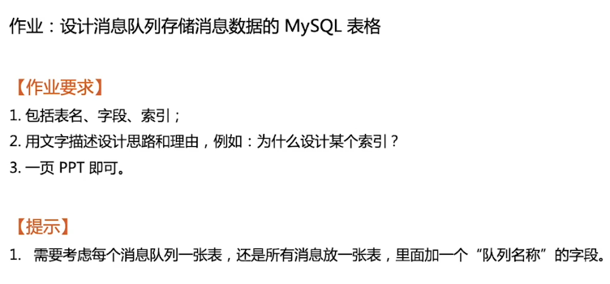

# 作业说明

# 消息队列

## 总体设计

1. 每个接入方都分配对应 APPID、SECRET，做鉴权
2. 根据 APPID 取模分库，避免接入方过多，引起性能问题
3. 消息表名：生成方APPID + "_" + 队列名，避免单表过大，引起性能问题
4. 消费表名：生产方APPID + "_" + 队列名 +  "_consumer"

## 详细字段

### 消息

| 字段名      | 类型     | 索引 | 说明                                                         |
| ----------- | -------- | ---- | ------------------------------------------------------------ |
| id          | BIGINT   | 是   | 数据库自动生成或者ID生成器生成[Leaf][https://github.com/Meituan-Dianping/Leaf]，ID 要求单调递增 |
| body        | BLOB     | 否   | 消息内容，二进制存储。不支持大于 65535 字节的消息 可上传到 s3，body 存下载地址 |
| create_time | DATETIME | 是   | 消息的创建时间                                               |

### 消费

| 字段名       | 类型     | 索引 | 说明                             |
| ------------ | -------- | ---- | -------------------------------- |
| id           | BIGINT   | 是   | 数据库自动生成                   |
| appid        | BIGINT   | 是   | 消费方appid                      |
| current_id   | BIGINT   |      | 已消费的最新ID                   |
| current_time | DATETIME |      | 已消费的最新ID对应的 create_time |

