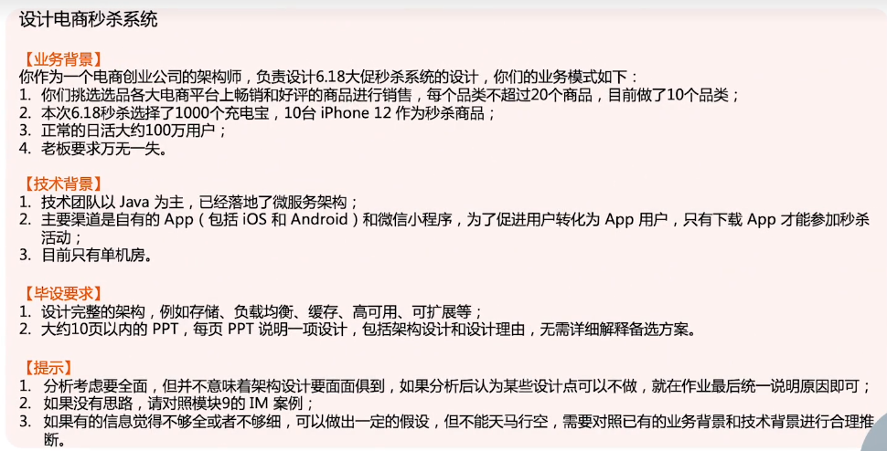
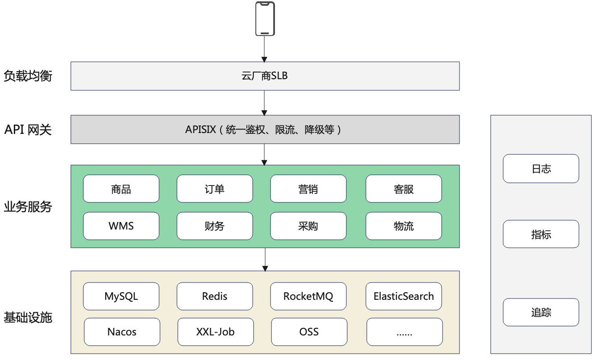

# 作业说明

# 电商秒杀系统

## 微服务框架选型

选择 [Spring Cloud Alibaba](https://github.com/alibaba/spring-cloud-alibaba/blob/master/README-zh.md)

1. Nacos：注册中心、配置中心
2. RocketMQ：消息队列
3. Seata：分布式事务
4. Sentinel：限流、熔断
5. CND、对象存储OSS使用云厂商
6. APM 选 skywalking
7. 分布式调度 选 XXL-Job

## 目前的架构图

## 秒杀业务

1. 秒杀属于营销的子业务。

2. 秒杀系统是典型的高性能、高可用系统，且流量上涨和回落速度都很快
3. 和促销系统分开建设，做到业务隔离

## 秒杀预估

1. 正常日活约 100 万用户，假设秒杀当日日活 1000 万（5到10倍的量）
2. 80%的用户在秒杀开始前后共10分钟内活跃，5倍的峰值系统

TPS：1000万 * 80% / 600 秒 * 5（峰值系数） = 1.67 万

## 高性能设计

### 计算高性能

1. 秒杀业务多实例部署
2. 采用 5 级缓存加速：APP 缓存、CDN、WEB容器缓存、进程内缓存、分布式缓存
3. 商品静态信息、秒杀商品库存总额提前刷到分布式缓存、进程内缓存中

### 存储高性能

1. 秒杀数据库多实例部署，读写分离、一主多从

## 高可用设计

### 计算高可用

1. 秒杀业务使用独立的服务器，k8s 部署方式，增/减服务器对上下游无感知
2. 降级：当系统的容量达到一定程度时，限制或者关闭系统的某些非核心功能，从而把有限的资源留给核心业务
3. 限流：当系统容量达到瓶颈时，通过限制一部分流量来保护系统

### 存储高可用

1. 秒杀业务使用专属的数据库、缓存集群
2. 数据库采用 TiDB，具备水平扩容或者缩容、金融级高可用、兼容 MySQL 5.7 协议等特性
3. 缓存采用 Redis Cluster

## 秒杀关键点

### 流量消峰

1. 排队：基于消息队列排队，超过队列最大长度可拒绝
2. 分层过滤：在不同的层次尽可能地过滤掉无效请求

### 商品不超卖

1. 秒杀商品一般都是低价促销，用户会第一时间付款，故采用“下单减库存”方式
2. 在数据库中完成减库存
3. 在应用程序中通过事务来判断减后库存不能为负数，否则回滚，下单失败

## 同城双中心

1. TiDB 支持[同城多中心部署](https://docs.pingcap.com/zh/tidb/stable/multi-data-centers-in-one-city-deployment)
2. 通过 [TiCDC](https://docs.pingcap.com/zh/tidb/stable/ticdc-overview)，把商品、库存等信息同步到缓存中

## 安全设计

1. 防刷、风控。在 API 网关加策略，初创公司最好购买云厂商相关服务
